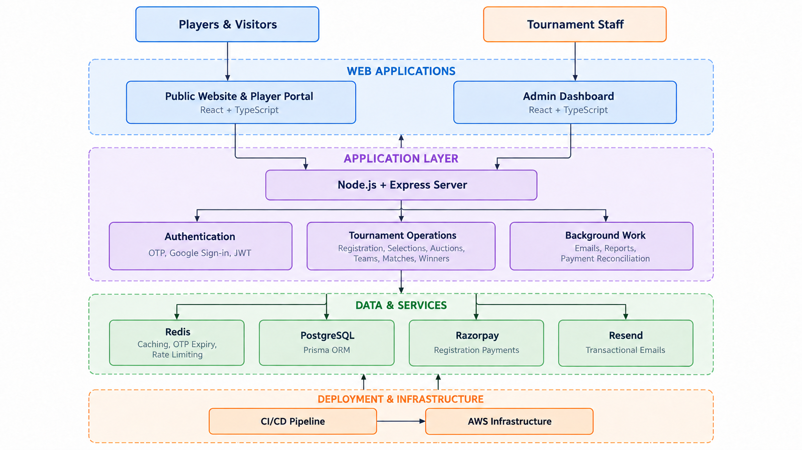

# Telangana Champions League

### A complete cricket tournament management platform

[](https://tclt20.co.in)
[](https://tclt20.co.in)
[](#technology-stack)
[](#technology-stack)

**Live website:** [tclt20.co.in](https://tclt20.co.in)

Telangana Champions League is a live platform built to manage a cricket tournament from start to finish. It brings player registrations, selection camps, auctions, teams, matches, and results into one system.

I worked on the public website, player portal, admin dashboard, backend, database design, payments, email delivery, and deployment setup.

## Project access

This is a live project used by real players and tournament staff, so I am not able to share the source code, production configuration, credentials, or user data publicly.

I can explain the complete project, including its architecture, database design, registration and payment flow, selection process, auction flow, admin controls, scaling work, and the problems solved during production.

I can also verify the numbers mentioned below by showing the live admin dashboard during a project walkthrough.

## Results

| Metric | Result |
| --- | ---: |
| Users reached on the live platform | **~50000** |
| Player logins | **12,000+** |
| Registration payments processed | **₹16 lakh+** |
| Transactional emails delivered | **20,000+** |

## What I built

### Player registration

- Email OTP and Google sign-in
- Player profile with district and playing-role details
- Tournament registration and eligibility checks
- Razorpay payment collection and server-side verification
- Unique district-based player number after successful registration
- Registration confirmation emails

### Selection process

- District-wise selection camp management
- Trial schedules, venues, and player tracking
- Selected and not-selected player records
- Player transfers between districts
- Selection announcements and instruction emails
- Filtered Excel exports for tournament staff

### Auctions and teams

- Auction eligibility and player pool
- Player base price and auction lot details
- Sold and unsold player status
- Team assignment and squad creation
- Tournament and team relationships

### Matches and winners

- Match schedules, teams, venues, and status
- Score and result records
- Live stream and external scoring links
- Tournament winner and runner-up details
- Player awards, prizes, and certificates

### Admin dashboard

- Separate login for tournament staff
- Role and permission based access
- Tournament, district, player, team, and registration management
- Search, filters, pagination, and status updates
- Registration open and close controls
- Payment and registration reconciliation
- Excel reports for daily operations

## Architecture



## How a player moves through the system

```text
Sign in
   ↓
Create player profile
   ↓
Choose tournament and district
   ↓
Complete registration payment
   ↓
Receive player number and confirmation
   ↓
Attend district selection camp
   ↓
Enter the auction pool if selected
   ↓
Join a team through the auction
   ↓
Play scheduled matches
   ↓
Results, awards, and tournament winner
```

## Handling traffic and reliability

The platform had to handle heavy traffic during registration announcements and selection updates. The main work in this area included:

- Redis caching for frequently used and short-lived data
- Redis-backed OTP expiry and authentication checks
- Rate limiting on sensitive and frequently called actions
- Pagination and database filtering for large admin lists
- Database transactions for player-number allocation
- Retry and timeout handling for Redis operations
- Server-side Razorpay signature verification
- Payment reconciliation for interrupted registration flows
- CI/CD pipelines for consistent deployments on AWS
- Compressed frontend builds for faster page loading

## Email system

The email system delivered more than 20,000 transactional messages. Reusable templates were created for:

- Login OTPs
- Registration confirmations
- Registration opening and closing notices
- Selection results
- Trial instructions
- Venue and schedule changes
- Unsubscribe requests

Suppression checks and unsubscribe handling were added to avoid sending messages to users who opted out.

## Technology stack

| Area | Technologies |
| --- | --- |
| Public website | React, TypeScript, Vite, Tailwind CSS, shadcn/ui |
| Admin dashboard | React, TypeScript, Vite, Tailwind CSS, Recharts, Vitest |
| Backend | Node.js, Express, REST, JWT, Google OAuth |
| Database | PostgreSQL, Prisma ORM |
| Cache | Redis, Upstash Redis |
| Payments | Razorpay |
| Email | Resend, reusable HTML templates |
| Infrastructure | AWS, CI/CD pipelines |
| Analytics | Google Analytics |

## Data covered by the system

```text
Tournament
├── Districts
│   ├── Selection camps
│   └── Trial matches
├── Registrations
│   └── Payment transactions
├── Players
│   ├── Selection status
│   └── Auction details
├── Teams
│   └── Team squads
├── Matches
│   └── Results
└── Winner, prizes, awards, and certificates
```

## Security and privacy

- Payment signatures are verified on the server
- OTPs expire automatically and are removed after use
- JWT authentication protects player and admin sessions
- Permissions control access to admin actions and exports
- Credentials are kept outside this public repository
- Production data and player information are not included

## About this repository

This repository is a project overview, not the production source code. It is intended to explain what I built, how the parts connect, and the scale at which the platform has been used.
